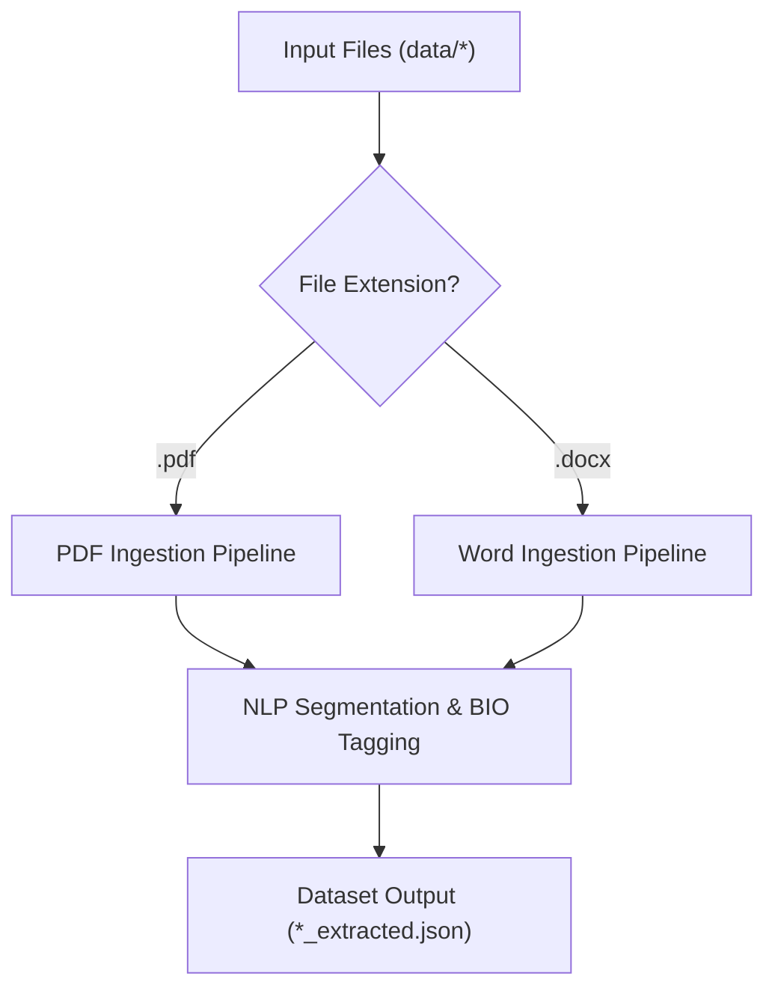
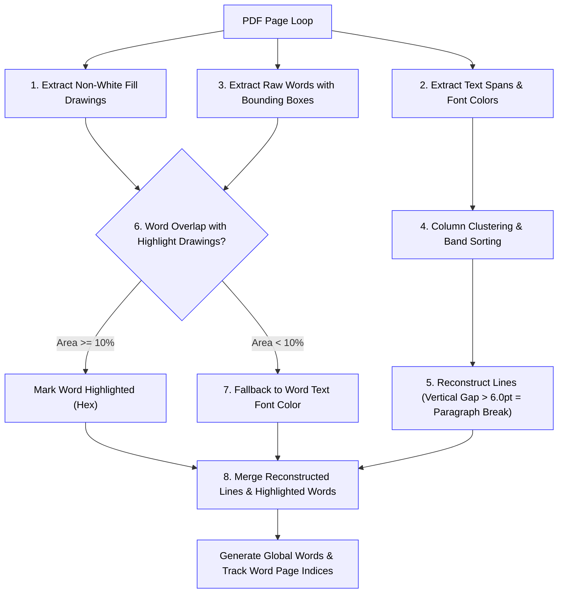
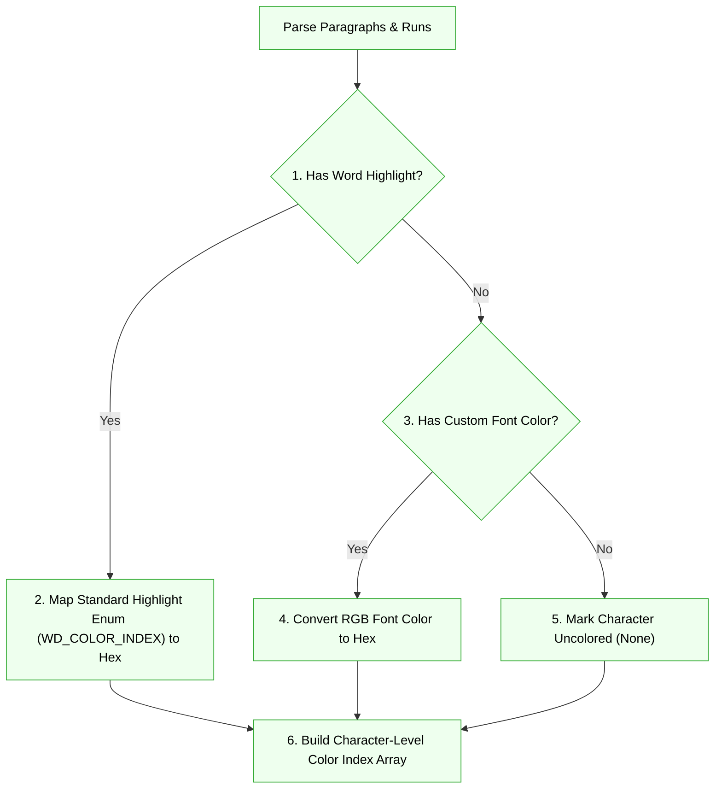
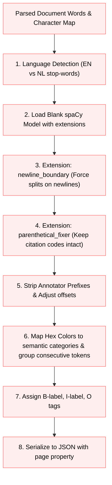

# The Highlight Extraction Pipeline

Developer-facing package guides document the local responsibilities and entry points for
the [web application](https://github.com/jurra/heva-toolkit/blob/main/src/heva/app/README.md),
[extraction adapters](https://github.com/jurra/heva-toolkit/blob/main/src/heva/extraction/README.md),
and [project workflow](https://github.com/jurra/heva-toolkit/blob/main/src/heva/workflow/README.md).

The extraction pipeline is designed to process documents, extract structured text and metadata, detect highlighting, segment sentences, and map highlight colors to semantic labels, producing a token-level dataset with BIO tags.

---

## Pipeline Architecture

The pipeline is divided into four distinct phases: File Routing, PDF-specific Ingestion (with layout sorting), DOCX-specific Ingestion, and NLP Sentence Tagging.

### 1. High-Level Ingestion & Routing
This stage identifies the file format and routes it to the appropriate parsing pipeline.

### 2. PDF Ingestion & Spatial Layout Pipeline
This stage processes PDF structures, clusters blocks into vertical columns, maps page indices, and identifies highlighted words by geometric overlap.

### 3. Word (DOCX) Highlight & Character Map Ingestion
This stage reads Word documents, parsing runs, and generating a character-level color map.

### 4. NLP Sentence Tagging & BIO Alignment
This shared pipeline segments sentences, normalizes text offsets, matches entities, and outputs the BIO dataset.

---

## Detailed Pipeline Execution

### 1. Ingestion & Extension Routing
The entry point (`src/heva/extraction/extract_highlights.py`) scans the `data/` directory and dynamically routes files depending on their extension:
* **PDF Documents**: Routed to `PyMuPDF` (`fitz`) processing in `src/heva/extraction/pdf_extractor.py`.
* **Word Documents**: Routed to `python-docx` processing in `src/heva/extraction/docx_extractor.py`.

### 2. PDF Processing & Layout Analysis
* **Drawings Extraction**: Highlights are represented as vector fill drawings. PyMuPDF fetches all non-white drawing coordinates (`page.get_drawings()`).
* **Text Spans**: Standard text characters and bounding boxes are extracted along with their colors (`page.get_text("dict")`).
* **Geometric Word/Highlight Intersection**: Bounding boxes of individual words are checked against highlight boxes. If a word's bounding box area overlaps a highlight drawing by **10% or more**, that word is flagged as highlighted with the drawing's fill color.
* **Text Color Fallback**: If a word has no overlapping highlight drawing, but the text font itself is colored (non-greyscale), the font color is mapped as the highlight color.
* **Page Tracking**: The system records the physical page number for every extracted word. As spaCy sentences are constructed from character boundaries, word-level page tracking dynamically determines the source `"page"` key for each sentence.

### 3. Spatial Column Clustering & Sorting (PDFs only)
To handle complex layout formats (like multi-column tables, headers, and side-by-side text), PyMuPDF text blocks are sorted using a **rotation-aware column-clustering sorting algorithm**:
* **Banding**: The script divides the page vertically into bands using full-width blocks (like headers or span-across-page text elements) as boundaries.
* **Clustering columns**: Within each band, blocks are clustered horizontally into distinct columns by analyzing overlap:
  * Two blocks belong to the same column if their horizontal overlap width is greater than 30% of the narrower block's width, or if they align vertically within a 5.0pt margin.
* **Rotation support**: Block sorting keys are computed dynamically depending on the page rotation angle ($0^\circ$, $90^\circ$, $180^\circ$, $270^\circ$).
* **Vertical grouping**: Blocks inside a column are sorted vertically, binning y-coordinates into lines with a 3.0pt tolerance.
* **Line reconstruction**: Paragraph breaks (`\n`) are introduced if the vertical gap between lines inside a block exceeds 6.0pt.

### 4. Word (DOCX) Processing
* **XML Paragraph/Run Parsers**: Paragraphs are traversed and decomposed into styling runs.
* **Word Preset Highlighting**: The parser checks standard Word highlight names (e.g.,
  `YELLOW`, `TURQUOISE`, `PINK`) via `run.font.highlight_color` and normalizes them to
  standard hex codes using `WORD_HIGHLIGHT_TO_HEX` from `src/heva/extraction/word_colors.py`.
* **Custom Font Coloring**: If no highlight is present, custom text colors are checked via `run.font.color.rgb` and mapped as a fallback.
* **Character-Level Mapping**: To prevent boundary issues, a character-level color index array is constructed mapping every single character in the paragraph to its dominant highlight color.

### 5. Multilingual Sentence Segmentation
* **Language Detection Heuristics**: The reconstructed document text is checked for stop-word frequency to automatically detect the language (English `en` vs Dutch `nl`).
* **spaCy Processing**: A blank spaCy model for the target language is initialized with a `sentencizer` component.
* **Pipeline Extensions**:
  * `newline_boundary`: A custom component runs before the sentencizer to ensure hard carriage newlines (`\n`) force sentence boundaries.
  * `parenthetical_fixer`: A custom component runs after the sentencizer to clear sentence boundaries on opening parentheses `(`, preventing parenthetical references or citation codes (e.g. `(relationship open/closed space) p. 8`) from being split from their parent sentence.
* **Prefix Stripping**: Common annotator prefixes (such as `Justification:`, `Justification:`, or `Standpunt:`) are stripped using a generalized regular expression, and the sentence character offsets are adjusted dynamically.

### 6. Entity Alignment & Dataset Formatting
* **Color Mapping**: With no mapping, extractors preserve normalized raw hex evidence.
  Semantic labels are applied only when an explicit mapping is passed. Confirmed mappings
  are loaded from the registered document's `metadata.json`.
* **Space-Insensitive Token Grouping**: Highlighted characters are matched back to spaCy tokens. Consecutive tokens highlighting the same category are grouped into a single entity (stripping leading/trailing spaces and punctuation). This prevents entity fragmentation.
* **BIO Matrix Generation**: BIO tags are generated: the first token of an entity gets a `B-<label>` tag, subsequent tokens get `I-<label>`, and unhighlighted tokens get `O`.
* **Output Serialization**: The sentences, values lists, tokens, entities, page index, and BIO tags are saved as structured JSON datasets in the target output path.

---

## BIO Tagging Scheme Application

The pipeline represents annotations using the standard **BIO (Beginning, Inside, Outside)** tagging scheme for Named Entity Recognition (NER) datasets. 

### Tag Definition & Logic
* **`O` (Outside)**: The token does not carry any highlight coloring (or is colored with a greyish/neutral shade).
* **`B-<label>` (Beginning)**: The token is the first token of a contiguous highlighted phrase belonging to category `<label>`.
* **`I-<label>` (Inside)**: The token is part of a highlighted phrase belonging to category `<label>` but is not the first token.

### Entity and Tag Alignment Rules

1. **Character to Token Alignment**: 
   The exact starting and ending character indices (`idx` to `idx + len(text)`) of each token generated by `spaCy` are intersected with the mapped highlight colors of the text.
2. **Consecutive Grouping**:
   If adjacent tokens share the same highlight category, the pipeline groups them into a single contiguous entity.
3. **Punctuation & Whitespace Trimming**:
   To keep target training spans semantically clean, the boundaries of grouped entities are trimmed of any leading or trailing spaces and punctuation (such as `,`, `.`, `:`, ';', `(`). Tokens that fall outside the cleaned span are tagged as `O`.
4. **Sequence Assignment**:
   For any grouped entity of length $N$ tokens:
   $$\text{Tokens} = [T_1, T_2, \dots, T_N]$$
   * $T_1$ is assigned the tag `B-<label>`.
   * $T_2 \dots T_N$ are assigned the tag `I-<label>`.
   * All other tokens in the sentence are assigned the tag `O`.

### Example Tagging Output

Given the input sentence with a highlighted section:

* **Sentence**: `"The principal port of Ceylon was Galle."`
* **Highlight Category**: `economic` (covering the phrase `"principal port of Ceylon"`)

| Token | Character Range | Mapped Highlight | Assigned BIO Tag |
| :--- | :--- | :--- | :--- |
| `The` | `0` to `3` | None | `O` |
| `principal` | `4` to `13` | `economic` | `B-economic` |
| `port` | `14` to `18` | `economic` | `I-economic` |
| `of` | `19` to `21` | `economic` | `I-economic` |
| `Ceylon` | `22` to `28` | `economic` | `I-economic` |
| `was` | `29` to `32` | None | `O` |
| `Galle` | `33` to `38` | None | `O` |
| `.` | `38` to `39` | None | `O` |

---

## Limitations & Possible Points of Failure

### 1. Hardcoded Geometric Thresholds
* **Layout Sorters**: Column binning uses fixed thresholds (`5.0` points for columns and `3.0` points for lines). If a document uses extremely tight column spacing or has slightly skewed/slanted lines, the reading order might get sorted incorrectly.
* **Paragraph Break Gap**: The vertical line separation threshold is hardcoded at `6.0` points. Tight margins inside lists or compact layouts might fail to generate newlines, leading to merged sentences. Conversely, large line spacing could split single paragraphs into multiple sentences.

### 2. PDF Drawing Overlap Tolerances
* **Intersection Threshold**: The overlap alignment relies on a minimum 10% bounding box intersection area to map drawings to text. If highlight blocks are misaligned due to poor PDF rendering or offset scanning, the highlighted entities might be omitted.
* **Marginal Highlight Overlaps**: If a highlight overlaps adjacent unhighlighted characters by more than 10%, those adjacent words may be incorrectly tagged as highlighted.

### 3. Font Encodings & Custom Ligatures
* **Non-Standard Characters**: Embedded PDF fonts sometimes use custom, non-standard Unicode mapping tables. For example, in the Zanzibar PDF, hyphens are encoded as the Greek Koppa character (`U+0372` / `Ͳ`), which normalizes to `U+0373` (`ͳ`) under standard casing. 
* **Mitigation**: While the pipeline includes a `normalize_ligatures` function, custom mappings must be maintained for new documents with unique font mapping issues.

### 4. Direct vs. Indirect Styling in Word Documents
* **Inherited Styles**: Custom colors or highlights applied via document-level stylesheet themes, style classes, or table formatting are not directly stored as run-level inline properties (`run.font.highlight_color` or `run.font.color.rgb`). If a document applies highlighting indirectly through these styles, the pipeline will fail to detect the highlighted regions.
* **Mitigation**: Highlights must be applied directly to the text runs inside Word.

### 5. Sentence Count & Offset Shifts in Oracle Files
* **Legend Omissions**: Human annotators (oracles) sometimes omit the legend/header pages (e.g. Zanzibar's `"Colour coding cultural values..."` legend), causing a mismatch in sentence counts and shifting sentence indices globally.
* **Punctuation Boundaries**: Oracle annotators sometimes include trailing punctuation (like periods or commas) inside the highlight boundary, whereas the tokenizer cleans punctuation from entities. This leads to minor text and character offset discrepancies during validation, even when semantic alignment is correct.
