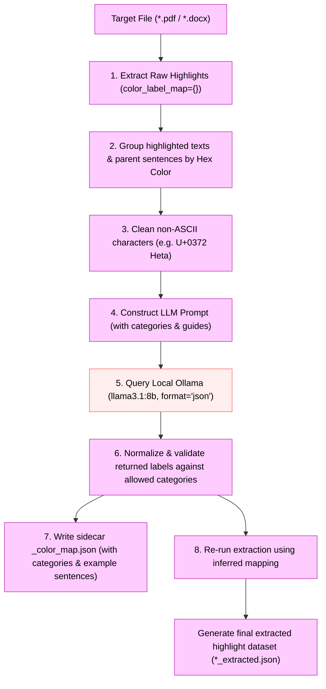

# Automated Color Mapper Architecture

The `src/auto_color_mapper.py` utility is a prototype zero-shot, LLM-powered
classification pipeline that proposes planning and heritage categories for document
highlight colors. Semantic color configuration is now document-local package data rather
than Python configuration.

> **Prototype limitation:** this script currently re-runs extraction immediately after an
> Ollama proposal. It does not enforce human confirmation and its output is not by itself
> curator-ready HEVA data. Use the supervised contract in
> [COLOR_MAPPING.md](COLOR_MAPPING.md) for document-local decisions.

---

## Architecture Flow

The automated mapper runs on top of the base extraction modules and orchestrates the Ollama classification task.



---

## Detailed Processing Stages

### 1. Raw Highlight Extraction & Metadata Grouping
The script first initiates a dry-run extraction by invoking `extract_colored_highlights` (for PDFs) or `extract_docx_highlights` (for Word documents) with an empty mapping (`color_label_map={}`). This captures:
* **Hex Codes / Color Names**: The exact color definitions parsed from drawings, fonts, or run properties.
* **Text Fragments**: Unique text snippets associated with each highlight color.
* **Parent Sentences**: Complete sentences in which the highlights reside.

### 2. Text Sanitization
Exotic Unicode characters present in text (such as the Greek Koppa/Heta symbol `Ͳ` used as a hyphen in some PDF encodings) are replaced with standard hyphens `-` before being sent to the LLM. This prevents tokenizer loop faults and increases vocabulary generation speed.

### 3. Zero-Shot Classification Prompt Formulation
The script constructs a detailed markdown prompt containing:
* **Target Categories**: Standard heritage/planning categories (`social`, `economic`, `political`, `historic`, `aesthetical`, `scientific`, `age`, `ecological`) alongside descriptions.
* **Semantic Translation Guide**: Example mappings for both Dutch and English terms (e.g., *ambachtelijke bedrijfjes* $\rightarrow$ *economic*, *stadsbestuur* $\rightarrow$ *political*, *stadsmuren* $\rightarrow$ *political*).
* **Target Highlight Groups**: The hexadecimal colors and their corresponding text fragment samples (up to 25 items).
* **Formatting Directives**: Strict instructions to output exactly a JSON structure containing two keys: `"reasoning"` (explanations per color) and `"mapping"` (assigned category per color).

### 4. Local LLM Execution
The script queries the local Ollama API (`/api/generate`) with:
* `"stream": false` to wait for the completed payload.
* `"format": "json"` to enforce structured JSON output.
* `"temperature": 0.0` to guarantee deterministic classifications.
* `"num_ctx": 16384` to prevent VRAM overflow while providing ample room for context reasoning.

### 5. Sidecar Configuration Generation
After validating the LLM classification, the script writes a sidecar configuration file (`<filename>_color_map.json`):
* **Format**: Maps each color to its category and an example sentence from the document:
  ```json
  {
      "#8E67AC": {
          "category": "economic",
          "reasoning": "The highlights relate to economic activities, such as shopping streets...",
          "sentence": "“Behind them towards the former creek snake out shopping streets belonging to the Indians...”"
      }
  }
  ```
* **Sentence Selection Algorithm**: The script extracts the full parent sentences for each color and sorts them. It filters out legend/header lines containing `"colour coding"` to prioritize real body paragraphs. It falls back to the legend line only if no other sentences exist.
