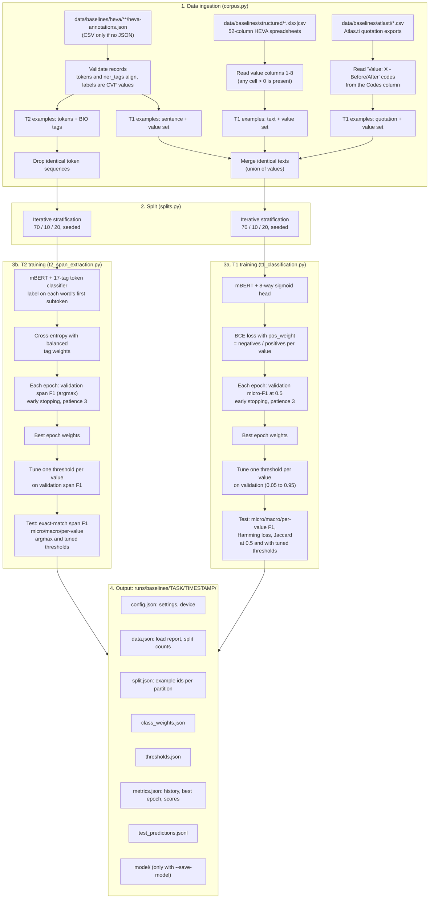

# HEVA baselines: T1 and T2

Fine-tuned multilingual BERT (mBERT) baselines for two tasks on the eight Cultural Value
Framework (CVF) values: `social`, `economic`, `political`, `historic`, `aesthetical`,
`scientific`, `age` and `ecological`.

- **T1: sentence-level value classification.** Assign each text the subset of the eight
  values it expresses (multi-label; the subset may be empty).
- **T2: value span extraction.** Tag the value-bearing spans in a sentence with BIO tags
  over the eight values (17 tags: `O`, plus `B-` and `I-` for each value).

## Quick start

```bash
pip install -e ".[baselines]"          # torch + transformers
python -m heva.baselines inspect       # load the data and show the split; no torch needed
python -m heva.baselines t1            # train and evaluate T1
python -m heva.baselines t2            # train and evaluate T2
python -m heva.baselines t1 --help     # all options
```

Input data goes in `data/baselines/` (see [its README](../../../data/baselines/README.md)).
Results go to `runs/baselines/`.

## Folder structure

| File | Role | Needs torch |
|---|---|---|
| `__main__.py` | Entry point for `python -m heva.baselines` | no |
| `cli.py` | Subcommands `inspect`, `t1` and `t2`, and their options | no (imports training lazily) |
| `labels.py` | The eight values in fixed order, the 17 BIO tags, label-name normalization (`Aesthetic` → `aesthetical`) | no |
| `corpus.py` | Loads HEVA Data Packages, structured spreadsheets and Atlas.ti CSV exports into T1/T2 examples, validates and deduplicates them | no (`openpyxl` for `.xlsx`) |
| `splits.py` | 70/10/20 iterative stratification and split summaries | no |
| `metrics.py` | T1 multi-label metrics and threshold tuning; T2 exact-match span F1 | no |
| `training.py` | Shared training settings, device choice, early stopping, optimizer schedule, output writing | yes |
| `t1_classification.py` | T1 model, loss, training loop and evaluation | yes |
| `t2_span_extraction.py` | T2 model, word/subword alignment, loss, training loop, threshold decoding and evaluation | yes |

Data loading, splitting and metrics deliberately avoid torch, so they are tested in the
normal test environment. The tests are in `tests/baselines/`; the end-to-end training
tests use a tiny randomly initialized BERT and are skipped when torch is missing.

## Pipeline



## Architecture

### 1. Data ingestion (`corpus.py`)

| Source | Location | Used for | Labels come from |
|---|---|---|---|
| HEVA Data Packages | `data/baselines/heva/<package>/heva-annotations.json` | T1 and T2 | `values` and `ner_tags` |
| Structured spreadsheets | `data/baselines/structured/*.xlsx` or `*.csv` | T1 only | value columns `1`–`8` |
| Atlas.ti exports | `data/baselines/atlasti/*.csv` | T1 only | `Value: <name>` codes in the `Codes` column |

- **HEVA:** T1 uses `curated_sentence` when it is set, otherwise `sentence`. T2 uses
  `tokens` and `ner_tags`. Records are skipped and counted when their tags do not line
  up with their tokens or they use unknown labels.
- **Structured spreadsheets:** the 52-column format of `EXAMPLE.xlsx` (e.g. the `*_3_final`
  files and `excels combined dataset.xlsx`). The text is `Sentence`, the collection
  `Folder_ID` and the document `Datasource`. A value is present when its column (`1` social
  … `8` ecological) is greater than 0, because some files store 2 for a value coded both
  Before and After. The first sheet with a `Sentence` column and columns `1`–`8` is read.
  Do not also put the Atlas.ti export of a collection that has a final spreadsheet in
  `atlasti/`: the two versions of a quotation can differ slightly and escape deduplication.
- **Collections:** every example records its collection: `Folder_ID` for spreadsheets,
  the package folder under `heva/` for Data Packages, and the file name for Atlas.ti CSVs.
- **Atlas.ti:** quotations have value codes for whole text blocks, not token spans, so
  they cannot feed T2. The `Before`/`After` suffix is dropped. Per-value 0/1 columns
  are ignored because they are 0 for quotations coded both Before and After.
  Quotations without any `Value:` code become examples with no values.
- **Deduplication:** identical texts are merged so they cannot land in both train and
  test. Several exports of one Atlas.ti project repeat the same quotations; their
  values are combined.

Every skipped, merged or conflicting record is counted in a load report, printed by
`inspect` and saved to `data.json`.

### 2. Split (`splits.py`)

Each task is split 70 / 10 / 20 into train, validation and test with iterative
stratification (Sechidis, Tsoumakas & Vlahavas, 2011). Rare values are distributed first,
so each split gets its share of them. The split is at text level and seeded
(`--seed`, default 13), and the example ids of each split are saved in `split.json`.

### 3. Models and training

Both tasks fine-tune `bert-base-multilingual-cased` with AdamW (weight decay 0.01),
10% linear warmup then linear decay, and gradient clipping at 1.0.

| | T1 | T2 |
|---|---|---|
| Head | 8 independent sigmoid outputs | 17-way softmax per word |
| Input | text, up to 512 subword tokens | pre-tokenized words, up to 512 subword tokens |
| Class-weighted loss | `BCEWithLogitsLoss`, `pos_weight` = negatives / positives per value | `CrossEntropyLoss`, weight = total / (tags present × tag count) |
| Epoch selection | validation micro-F1 at threshold 0.5 | validation exact-match span F1, argmax decoding |
| Thresholds | per value: F1-maximizing on validation | per value: a word gets its most probable value tag only if its probability reaches the threshold |

In T2, only the first subtoken of each word carries a label; the model's prediction for
that subtoken is the word's prediction. Words cut off by the length limit are predicted
as `O` and counted in `test_truncated_words`.

**Early stopping:** training runs for at most `--epochs` (default 20) and stops after
`--patience` (default 3) epochs without a validation improvement. The best epoch's
weights are restored before threshold tuning and testing.

**Threshold tuning:** thresholds are searched from 0.05 to 0.95 in steps of 0.05. A value
with no validation examples keeps 0.5. Ties go to the threshold closest to 0.5.

### 4. Evaluation (`metrics.py`)

**T1**, on 0/1 vectors over the eight values:

- micro-F1 (with precision and recall): all text × value decisions pooled;
- macro-F1: average over values present in the gold data; absent values are listed
  under `classes_without_support` instead of scoring 0;
- per-value precision, recall, F1 and support;
- Hamming loss: share of wrong value decisions (lower is better);
- Jaccard similarity: mean |gold ∩ predicted| / |gold ∪ predicted| per text, 1.0 when both
  are empty.

**T2**, exact-match span F1: a predicted span counts only if its start, end and value all
match a gold span. Spans are read with conlleval rules, so an `I-` tag without a
preceding `B-` still starts a span. Micro, macro and per-value scores are reported.

### 5. Output

Each run creates `runs/baselines/<t1|t2>/<YYYYMMDD-HHMMSS>/`:

| File | Content |
|---|---|
| `config.json` | All training settings, including the effective max length and device |
| `data.json` | Load report (files, skipped, merged) and value counts per split |
| `split.json` | Example ids in train, validation and test |
| `class_weights.json` | T1 `pos_weight` per value, or T2 weight per BIO tag |
| `thresholds.json` | Tuned threshold per value |
| `metrics.json` | Per-epoch history, `best_epoch`, `epochs_trained`, and the scores below |
| `test_predictions.jsonl` | One line per test example: gold and predicted values (T1, with probabilities) or tags (T2) |
| `model/` | Fine-tuned model and tokenizer, only with `--save-model` (about 700 MB) |

Scores in `metrics.json`:

| Key | T1 | T2 |
|---|---|---|
| `validation_tuned` | validation, tuned thresholds (optimistic: tuned on this data) | same |
| `test_default_0.5` | test, every threshold 0.5 | — |
| `test_argmax` | — | test, most probable tag per word |
| `test_tuned` | test, tuned thresholds (main result) | same |
| `truncated_texts` / `test_truncated_words` | texts over the length limit, per split | test words cut off |

## Defaults and options

| Option | Default | Notes |
|---|---|---|
| `--data-dir` | `data/baselines` | contains `heva/`, `structured/` and `atlasti/` |
| `--output-dir` | `runs/baselines` | |
| `--model` | `bert-base-multilingual-cased` | any Hugging Face name or local path |
| `--epochs` | 20 | maximum; early stopping usually ends sooner |
| `--patience` | 3 | |
| `--batch-size` | 16 | |
| `--learning-rate` | 2e-5 | |
| `--max-length` | 512 | capped at the model's limit |
| `--device` | `auto` | CUDA, then Apple MPS, then CPU |
| `--seed` | 13 | fixes the split and training |
| `--save-model` | off | |

## Limitations

- T1 is a flat eight-value classifier; hierarchical labels (for example Before/After or
  Atlas.ti attribute codes) are not modeled.
- The split is at text level, so sentences from one document can appear in both train and
  test.
- Texts longer than 512 subword tokens are cut off rather than split into windows.
- With small validation sets, tuned thresholds can overfit; compare `test_tuned` with
  `test_default_0.5` / `test_argmax`.
